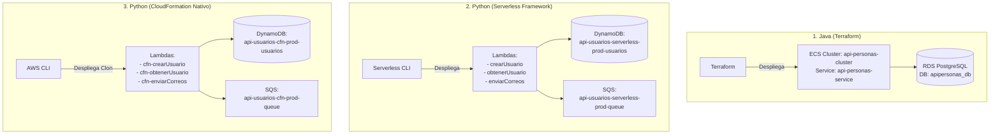
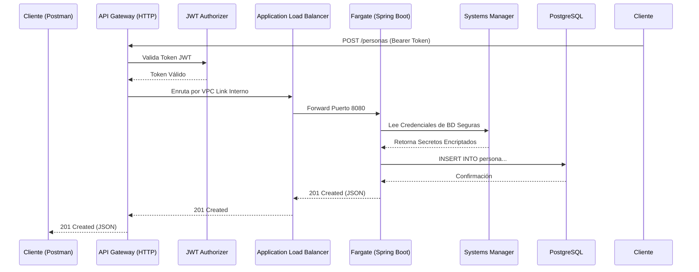
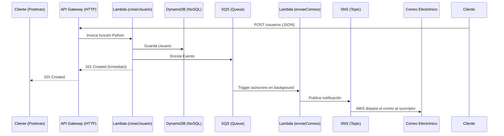

# Reto AWS - Pragma 🚀

Este repositorio contiene mi implementación paso a paso del Reto AWS, combinando arquitecturas limpias, programación reactiva y despliegues en la nube usando Infraestructura como Código (Terraform, Serverless Framework y CloudFormation).

## 📁 Estructura del Proyecto

He diseñado el proyecto de manera modular y escalable para separar responsabilidades. En la raíz encontrarás 4 componentes principales:

1. **`api-personas/`** (Java + Spring Boot WebFlux): Contiene mi microservicio principal. Escrito en Java 17 usando Arquitectura Hexagonal y Programación Reactiva Pura (Project Reactor, cero `if`, cero `try-catch`). Se conecta a RDS (PostgreSQL).
2. **`python-lambdas/`** (Python + Serverless Framework): Contiene mis funciones Serverless. Despliega la API de "Usuarios" directamente a AWS Lambda y DynamoDB.
3. **`terraform/`**: Contiene todo el código de aprovisionamiento de infraestructura automatizado (IaaC) para AWS.
4. **`kubernetes/`**: Contiene los manifiestos YAML (`deployment`, `service`, `configmap`, `secret`, `ingress`) para orquestar localmente mi contenedor de la API usando Kubernetes.
5. **`cloudformation/`**: Contiene el código de Infraestructura como Código nativo de AWS (`template.yaml`) donde repliqué manualmente todo el ecosistema Serverless (Lambdas, DynamoDB, SQS, SNS) sin usar frameworks externos.

## 🌍 Arquitectura Global del Ecosistema (Mis 3 Vías de Despliegue)
En este reto demuestro el dominio de múltiples tecnologías y formas de orquestación, conviviendo pacíficamente en mi misma cuenta de AWS:



---

## 🏗️ Arquitectura Detallada (Fase 1 y 2: Java + Terraform)



---

## 🌩️ Arquitectura Serverless (DynamoDB, SQS y SNS)

Para las Fases 4 y 5, opté por un enfoque 100% manejado por eventos usando Serverless Framework y Python.



---

## 🎯 Progreso de Implementación y Guía de Pruebas

A continuación detallo cómo probar cada una de las Fases del reto y comprobar las Historias de Usuario (HU).

### Fase 1: API Spring Boot y Base de Datos Relacional (HU1, HU2)
Construí la API en Java usando Spring WebFlux y R2DBC para conectarme a PostgreSQL de manera reactiva.

**Pruebas Locales (Maven/Docker):**
```bash
# Compilar y correr pruebas unitarias
./mvnw clean test

# Levantar base de datos local
cd api-personas && docker-compose up -d

# Levantar aplicación Spring Boot
./mvnw spring-boot:run
```

### Fase 2: Despliegue en AWS con Contenedores (HU3)
Escribí un Dockerfile y orquesté todo el despliegue a ECS (Fargate), ALB, ECR, API Gateway y RDS en AWS usando Terraform.

### Fase 3: Seguridad y Configuración (HU4, HU5, HU6)
Protegí el API original con Amazon Cognito, parametricé las variables sensibles usando SSM Parameter Store, y creé Alarmas en CloudWatch.

**Pruebas (Cognito):**
1. **Generar Token JWT:**
   ```bash
   aws cognito-idp initiate-auth --auth-flow USER_PASSWORD_AUTH --client-id 1j5d13svvnbpjbm4rc2qc7r12n --auth-parameters USERNAME=<USUARIO>,PASSWORD='<PASSWORD>' --region us-east-1
   ```
2. **Postman:** Extraer el campo `IdToken`, ir a Postman, configurar **Bearer Token**, y hacer un `POST /personas` a `https://czzrym1w3c.execute-api.us-east-1.amazonaws.com/personas`.

**Pruebas (CloudWatch):**
```bash
# Forzar alarma manualmente
aws cloudwatch set-alarm-state --alarm-name "api-personas-high-cpu" --state-value ALARM --state-reason "Prueba manual de estado" --region us-east-1
```

### Fase 4 y 5: Serverless Framework (DynamoDB, SQS, SNS) (HU7, HU8, HU9)
Usé **Serverless Framework** para crear una tabla en DynamoDB, una cola SQS, un tópico SNS y funciones Lambda en Python 3.9 para administrar "Usuarios".

**Pruebas (API Serverless):**
* POST `https://6kjbrlh85b.execute-api.us-east-1.amazonaws.com/usuarios` (Body: `{"nombre": "Camilo", "correo": "correo@gmail.com"}`)
* GET `https://6kjbrlh85b.execute-api.us-east-1.amazonaws.com/usuarios/{id}`

**Pruebas (Mensajería Asíncrona):**
1. Ve a AWS -> SNS -> Tópicos -> `api-usuarios-serverless-prod-topic`.
2. Crea una suscripción "Email" con tu correo personal. Confírmala en tu bandeja.
3. Dispara un POST. La Lambda guardará en DynamoDB, encolará en SQS, y otra Lambda desencoladora mandará tu notificación por SNS al correo.

### Fase 6: DevOps y Kubernetes (Local) (HU10, HU11)
Creé manifiestos de Kubernetes (`deployment.yaml`, `service.yaml`, etc.) para orquestar localmente mi API, demostrando que no dependo únicamente de AWS ECS para levantar los contenedores. Además elaboré un `azure-pipelines.yml` para ilustrar procesos CI/CD.

**Pruebas (Kubernetes Local en Docker Desktop):**
```bash
# 1. Aplicar todos los manifiestos y encender contenedores
cd kubernetes
kubectl apply -f .

# 2. Listar pods y ver su estado
kubectl get pods

# 3. Ver logs de mi aplicación
kubectl logs -f -l app=api-personas

# 4. Consumir el API (El servicio enruta al puerto 80)
curl -X GET "http://localhost:80/personas/1"

# 5. Apagar y limpiar el clúster local
kubectl delete -f .
```

### Fase 7: CloudFormation Puro (Migración de HU7, HU8, HU9) (Completado)
En lugar de depender de Serverless Framework para provisionar mi infraestructura, escribí manualmente los manifiestos crudos en AWS CloudFormation (`template.yaml`). Esto demuestra mi dominio profundo sobre `AWS::DynamoDB::Table`, `AWS::SQS::Queue`, `AWS::Lambda::Function` y las Políticas de IAM necesarias para orquestar todo de forma nativa.

**Pruebas (Despliegue de CloudFormation CLI):**
```bash
# Empaquetar el template
aws cloudformation package --template-file cloudformation/template.yaml --s3-bucket pragma-reto-cfn-367553824468 --output-template-file cloudformation/packaged.yaml

# Desplegar el stack manualmente
aws cloudformation deploy --template-file cloudformation/packaged.yaml --stack-name api-usuarios-cfn --capabilities CAPABILITY_IAM
```

---
**Comandos Generales y Útiles:**

* **Ver imágenes de Docker construidas:** `docker images`
* **Limpiar el sistema de Docker y caché:** `docker system prune -a`
* **Reiniciar el backend en ECS forzando nueva imagen:**
  ```bash
  aws ecs update-service --cluster api-personas-cluster --service api-personas-service --force-new-deployment
  ```
