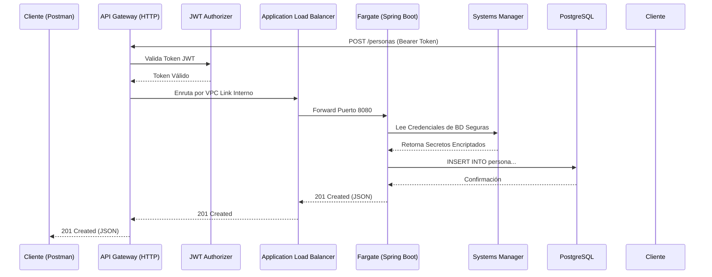

# Reto AWS - Pragma 🚀

Este repositorio contiene la implementación paso a paso del Reto AWS, combinando arquitecturas limpias, programación reactiva y despliegues en la nube usando Infraestructura como Código (Terraform y Serverless Framework).

## 📁 Estructura del Proyecto

El proyecto ha sido diseñado de manera modular y escalable para separar responsabilidades. En la raíz encontrarás 3 componentes principales:

1. **`api-personas/`** (Java + Spring Boot WebFlux): Contiene el microservicio principal. Escrito en Java 17 usando Arquitectura Hexagonal y Programación Reactiva Pura (Project Reactor, cero `if`, cero `try-catch`). Se conecta a RDS (PostgreSQL).
2. **`python-lambdas/`** (Python + Serverless Framework): Contiene funciones Serverless manejadas independientemente. Despliega la API de "Usuarios" directamente a AWS Lambda y DynamoDB.
3. **`terraform/`**: Contiene todo el código de aprovisionamiento de infraestructura automatizado (IaaC) para AWS.

---

## 🏗️ Arquitectura Desplegada en AWS

La infraestructura está totalmente automatizada. Para la **Fase 2 y 3**, se orquestó la siguiente arquitectura:



---

## 🎯 Progreso de Implementación y Guía de Pruebas

A continuación se detalla cómo un evaluador puede probar cada una de las Fases del reto y comprobar las Historias de Usuario (HU).

### Fase 1 y 2: API Spring Boot y Despliegue en Contenedores (Completado)
* **¿Qué se hizo?** Se construyó el API en Java, se probó localmente, se escribió un Dockerfile y se orquestó todo el despliegue a ECS, ALB, ECR, API Gateway y RDS en AWS usando Terraform.
* **Prueba:** Hacer una petición sin token fallará gracias a que ya integramos Cognito (ver Fase 3). 

### Fase 3: Seguridad y Configuración (Completado)
* **¿Qué se hizo?** Se protegió el API original con Amazon Cognito, se parametrizaron las variables sensibles usando SSM Parameter Store, y se crearon Alarmas en CloudWatch.
* **¿Cómo probar (Cognito)?**
  1. El API Base URL es: `https://czzrym1w3c.execute-api.us-east-1.amazonaws.com`
  2. Generar el Token JWT por consola (Reemplazar datos):
     ```bash
     aws cognito-idp initiate-auth --auth-flow USER_PASSWORD_AUTH --client-id 1j5d13svvnbpjbm4rc2qc7r12n --auth-parameters USERNAME=<USUARIO>,PASSWORD='<PASSWORD>' --region us-east-1
     ```
  3. Extraer el campo `IdToken` del JSON resultante, ir a **Postman**, configurar Autorización de tipo **Bearer Token**, pegarlo y hacer un `POST /personas` o `GET /personas/{id}`.
* **¿Cómo probar (CloudWatch)?**
  Puedes disparar la Alarma de CPU Alta manualmente desde tu terminal para probar su correcto funcionamiento ejecutando:
  ```bash
  aws cloudwatch set-alarm-state --alarm-name "api-personas-high-cpu" --state-value ALARM --state-reason "Prueba manual de estado" --region us-east-1
  ```

### Fase 4: Serverless Framework y DynamoDB (Completado)
* **¿Qué se hizo?** Se usó **Serverless Framework** para crear una tabla en **DynamoDB** y 2 funciones en **AWS Lambda** escritas en Python 3.9 para administrar "Usuarios".
* **¿Cómo probar?** Estos endpoints no requieren token (son de acceso público para validar DynamoDB):
  1. **POST** `https://6kjbrlh85b.execute-api.us-east-1.amazonaws.com/usuarios`
     *Body:* `{"nombre": "Camilo", "correo": "camilo@pragma.com"}`
  2. **GET** `https://6kjbrlh85b.execute-api.us-east-1.amazonaws.com/usuarios/{id}` (reemplazando el ID que devolvió el POST).

---

### Siguientes Fases (En Progreso / Pendientes)
* **Fase 5 (HU9):** Mensajería asíncrona usando **SQS** y notificaciones con **SNS**.
* **Fase 6 (HU10, HU11):** Integración continua con Azure DevOps Pipeline y simulaciones locales con Kubernetes (Minikube).
