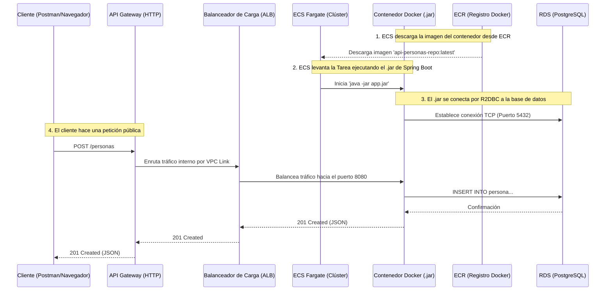
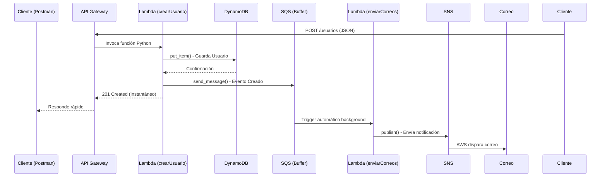

# Guión y Plan de Implementación: Backend Reto AWS

Este documento es mi guía detallada y script de exposición sobre cómo abordé e implementé el Reto AWS. El trabajo lo dividí por Historias de Usuario (HU), lo que me permitió validar, iterar y hacer commits por cada avance de forma independiente, combinando arquitecturas limpias, programación reactiva y despliegues robustos en la nube.

## 🏗️ Directrices de Arquitectura y Base de Datos

> [!TIP]
> **Base de Datos y Entorno Local:**
> Respeté los requerimientos al pie de la letra: utilicé **RDS (PostgreSQL)** para el API en Spring Boot y **DynamoDB (NoSQL)** para las Lambdas. 
> Dado que utilicé programación reactiva (Spring WebFlux), implementé **R2DBC** (Reactive Relational Database Connectivity) para conectarme a PostgreSQL de manera no bloqueante. Usé Docker local para levantar el contenedor de Postgres simulando el RDS durante el desarrollo.

## 🗺️ Ejecución por Historias de Usuario (HU)

### 📍 Fase 1: API Spring Boot y Base de Datos Relacional (HU1, HU2)

**HU1: Integrar sonarlint en el back y construir API**
- [x] Generé el proyecto Spring Boot WebFlux *(Archivo: `api-personas/pom.xml`)*.
- [x] Configuré plugins de Jacoco (cobertura) y SonarLint/SonarQube *(Archivo: `api-personas/pom.xml`)*.
- [x] Implementé la Capa de Dominio y Casos de Uso siguiendo Arquitectura Hexagonal *(Archivos: `api-personas/src/main/java/com/pragma/aws/apipersonas/domain/model/Persona.java`, `api-personas/src/main/java/com/pragma/aws/apipersonas/application/usecase/PersonaUseCase.java`)*.
- [x] Implementé la Capa de Infraestructura (Router y Handler) para 2 endpoints: guardarPersona y consultarPersona *(Archivos: `api-personas/src/main/java/com/pragma/aws/apipersonas/infrastructure/adapter/in/rest/PersonaRouter.java`, `api-personas/src/main/java/com/pragma/aws/apipersonas/infrastructure/adapter/in/rest/PersonaHandler.java`)*.
- [x] Escribí tests unitarios descriptivos *(Carpeta: `api-personas/src/test/java/com/pragma/aws/apipersonas/`)*.
- [x] Implementé Swagger (OpenAPI) para documentar mis endpoints reactivos *(Archivo: `api-personas/src/main/java/com/pragma/aws/apipersonas/infrastructure/adapter/in/rest/PersonaRouter.java`)*.

**HU2: Aprovisionar la base de datos relacional con RDS**
- [x] Configuré un archivo docker-compose para levantar PostgreSQL localmente *(Archivo: `api-personas/docker-compose.yml`)*.
- [x] Integré R2DBC y Spring Data R2DBC en el proyecto *(Archivo: `api-personas/pom.xml`)*.
- [x] Actualicé el adaptador de base de datos (`PersonaDbAdapter`) para que persista en base de datos *(Archivo: `api-personas/src/main/java/com/pragma/aws/apipersonas/infrastructure/adapter/out/persistence/PersonaDbAdapter.java`)*.
- [x] Creé el módulo de Terraform para aprovisionar el RDS real en AWS *(Archivo: `terraform/rds/main.tf`)*.

#### Pruebas y Comandos:
- **Ejecutar tests unitarios:** `./mvnw clean test`
- **Levantar aplicación local:** `./mvnw spring-boot:run`
- **Swagger UI (Local):** `http://localhost:8080/webjars/swagger-ui/index.html` (o `/swagger-ui.html`).
- **Swagger UI (AWS):** Disponible mediante la URL pública del API Gateway (`/swagger-ui.html`), asumiendo que la imagen de ECR esté actualizada.

---

### 📍 Fase 2: Despliegue en AWS con Contenedores (HU3)

**HU3: Desplegar el API**
- [x] Creé el `Dockerfile` optimizado para empaquetar el `.jar` de Spring Boot *(Archivo: `api-personas/Dockerfile`)*.
- [x] Creé módulos de Terraform para ECR (registro de la imagen) y ECS (Fargate para correr el contenedor) *(Archivos: `terraform/ecr/main.tf`, `terraform/ecs/main.tf`)*.
- [x] Creé el módulo de Terraform para el API Gateway HTTP y el Balanceador de Carga (ALB) junto con su VPC Link *(Archivos: `terraform/api_gateway/main.tf`, `terraform/alb/main.tf`)*.

#### Detalles de la Infraestructura en AWS (Terraform)
Construí la arquitectura creando módulos especializados:
- **VPC (Red Virtual):** Para simplificar la arquitectura y reducir costos (los NAT Gateways son costosos), reutilicé la VPC por defecto de tu cuenta de AWS *(Archivo: `terraform/ecs/main.tf` y `terraform/alb/main.tf`, Bloque: `data "aws_security_group" "default"` y uso de subnets hardcodeadas `subnet-0...`)*. Los componentes como ECS, RDS y el ALB se despliegan en estas subredes existentes.
- **El JAR y ECR (Elastic Container Registry):** Automáticamente mediante Terraform, compilo mi código Java y empujo la imagen Docker hacia ECR *(Archivo: `terraform/ecr/main.tf`, Bloque: `resource "aws_ecr_repository" "repo"` y Archivo: `terraform/main.tf`, Bloque: `resource "null_resource" "docker_push"`)*.
- **ECS (Elastic Container Service - Fargate):** Aprovisioné un clúster Serverless *(Archivo: `terraform/ecs/main.tf`, Bloque: `resource "aws_ecs_cluster" "main"`)*. Aquí configuré una *Task Definition* *(Bloque: `resource "aws_ecs_task_definition" "app"`)* que descarga mi imagen desde ECR y ejecuta el contenedor asignándole Memoria y CPU exacta, sin administrar máquinas virtuales (EC2).
- **ALB (Application Load Balancer):** Se encarga de recibir el tráfico desde el API Gateway y balancearlo hacia el puerto `8080` de mis contenedores activos en ECS *(Archivo: `terraform/alb/main.tf`, Bloques: `resource "aws_lb" "main"` y `resource "aws_lb_target_group" "app"`)*. Está desplegado en subredes privadas.
- **API Gateway (HTTP API):** Es mi puerta de entrada pública *(Archivo: `terraform/api_gateway/main.tf`, Bloque: `resource "aws_apigatewayv2_api" "main"`)*. Usé un **VPC Link** *(Bloque: `resource "aws_apigatewayv2_vpc_link" "vpc_link"`)* para que el API Gateway pueda comunicarse de forma segura con el ALB interno sin exponer el ALB a Internet.
- **RDS (Relational Database Service):** Aprovisioné un motor de PostgreSQL administrado. El contenedor en ECS se conecta a este RDS usando las credenciales inyectadas de forma segura *(Archivo: `terraform/rds/main.tf`, Bloque: `resource "aws_db_instance" "postgres"`)*.



---

### 📍 Fase 3: Seguridad y Configuración (HU4, HU5, HU6)

**HU4: Agregar autenticación al sistema (Cognito)**
- [x] Creé el módulo de Terraform para Amazon Cognito *(Archivo: `terraform/cognito/main.tf`, Bloque: `resource "aws_cognito_user_pool" "main"`)*.
- [x] Integré Cognito en el API Gateway para exigir token JWT *(Archivo: `terraform/api_gateway/main.tf`, Bloque: `resource "aws_apigatewayv2_authorizer" "cognito"`)*.

**HU5: Variables de entorno (Parameter Store / Secrets Manager)**
- [x] Moví la URL de BD y credenciales al Parameter Store (cifrado con KMS) *(Archivo: `terraform/ssm/main.tf`, Bloques: `resource "aws_ssm_parameter" "db_url" / "db_password"`)*.
- [x] Configuré ECS para inyectar estos secretos como variables de entorno al contenedor *(Archivo: `terraform/ecs/main.tf`, Bloque: `secrets = [...]` dentro del container_definitions)*.

**HU6: Logs y Trazas**
- [x] Configuré CloudWatch Logs en ECS *(Archivo: `terraform/ecs/main.tf`, Bloque: `logConfiguration` dentro del container_definitions)*.
- [x] Creé alarmas de uso de CPU en CloudWatch mediante Terraform *(Archivo: `terraform/cloudwatch/main.tf`, Bloque: `resource "aws_cloudwatch_metric_alarm" "high_cpu"`)*.

#### Pruebas (Seguridad y CloudWatch):
1. **Generar Token Cognito (Terminal):**
   ```bash
   aws cognito-idp initiate-auth --auth-flow USER_PASSWORD_AUTH --client-id <CLIENT_ID> --auth-parameters USERNAME=<USUARIO>,PASSWORD='<PASSWORD>' --region us-east-1
   ```
2. **Probar el API:** Usar el `IdToken` resultante en Postman como Bearer Token para consumir los endpoints.
3. **Forzar Alarma CloudWatch:**
   ```bash
   aws cloudwatch set-alarm-state --alarm-name "api-personas-high-cpu" --state-value ALARM --state-reason "Prueba de estado" --region us-east-1
   ```

---

### 📍 Fase 4: Serverless Framework y DynamoDB (HU7, HU8)

**HU7: Lambda API Usuarios (Serverless Framework)**
- [x] Creé el proyecto Serverless *(Archivo: `python-lambdas/serverless.yml`)*.
- [x] Desarrollé Lambdas en Python (`crearUsuario`, `obtenerUsuario`) *(Archivo: `python-lambdas/usuarios_handler.py`, Bloques: `def crear_usuario(...)` y `def obtener_usuario(...)`)*.
- [x] Desplegué usando `serverless deploy`.

**HU8: Base de datos NoSQL (DynamoDB)**
- [x] Aprovisioné la tabla DynamoDB desde Serverless *(Archivo: `python-lambdas/serverless.yml`, Bloque: `UsuariosTable`)*.
- [x] Conecté mis Lambdas para persistir y consultar usuarios *(Archivo: `python-lambdas/usuarios_handler.py`, Bloque: `dynamodb.Table(...)`)*.

---

### 📍 Fase 5: Mensajería y Eventos (HU9)

**HU9: Envío de mensajes encolados (SQS y SNS)**
- [x] Creé la cola SQS y el tópico SNS *(Archivo: `python-lambdas/serverless.yml`, Bloques: `UsuariosQueue` y `NotificacionesTopic`)*.
- [x] Actualicé la Lambda `crearUsuario` para depositar un evento en SQS tras guardar en Dynamo *(Archivo: `python-lambdas/usuarios_handler.py`, Bloque: `sqs.send_message(...)`)*.
- [x] Construí una Lambda desencoladora (`enviarCorreos`) que procesa mensajes de SQS y usa SNS para notificar por correo *(Archivo: `python-lambdas/notificaciones_handler.py`, Bloque: `def enviar_correos(...)`)*.

#### Detalles del Ecosistema Serverless (Lambdas, Dynamo, SQS, SNS)
Opté por Python por su agilidad en el ecosistema Serverless. 
*   **Contexto de Lambdas:** Creé `usuarios_handler.py` (crear y buscar) y `notificaciones_handler.py`. Al ejecutar un `POST /usuarios` *(Archivo: `python-lambdas/serverless.yml`, Bloque: `functions -> crearUsuario -> events -> http`)*, la Lambda principal guarda en DynamoDB y empuja el evento a SQS.
*   **¿Para qué SQS y SNS separados?** SQS actúa como un "amortiguador" (buffer) *(Archivo: `python-lambdas/serverless.yml`, Bloque: `UsuariosQueue`)*. Si miles de usuarios se registran, la API responde casi instantáneamente porque SQS retiene temporalmente las tareas pesadas (enviar correos). Luego, otra Lambda consume de SQS a su propio ritmo *(Archivo: `python-lambdas/serverless.yml`, Bloque: `functions -> enviarCorreos -> events -> sqs`)* y envía las alertas usando SNS (correo electrónico) *(Archivo: `python-lambdas/notificaciones_handler.py`, Bloque: `sns.publish(...)`)*. Esto garantiza escalabilidad y resiliencia sin afectar la experiencia del usuario.



#### Pruebas:
- **Endpoints Públicos (No requieren Token):**
  - POST: `https://6kjbrlh85b.execute-api.us-east-1.amazonaws.com/usuarios` (Body: `{"nombre": "Camilo", "correo": "mi@correo.com"}`)
  - GET: `https://6kjbrlh85b.execute-api.us-east-1.amazonaws.com/usuarios/{id}`

---

### 📍 Fase 6: DevOps y Kubernetes (HU10, HU11)

**HU10: Azure DevOps Pipeline**
- [x] Creé `azure-pipelines.yml` para ilustrar la Integración Continua (CI) *(Archivo: `azure-pipelines.yml`, Bloques: `stages -> Build`, `Test`, `SonarQube`)*.
- **¿Qué es DevOps? (Concepto para estudiar/exponer):** DevOps no es una herramienta, es una cultura de trabajo. Su objetivo es romper el "muro" que tradicionalmente existía entre los desarrolladores (Dev), que querían lanzar código rápido, y el equipo de operaciones (Ops), que quería estabilidad. Al unirlos, logramos entregas de software más rápidas, seguras y automáticas.
- **¿Qué es un Pipeline y qué pasos configuré?** Un pipeline es una tubería automatizada por donde pasa el código antes de llegar a producción. En mi archivo *(Archivo: `azure-pipelines.yml`)*, definí los siguientes pasos (Stages):
  1.  **Build:** Compila el código de Java asegurando que no haya errores de sintaxis.
  2.  **Test:** Ejecuta automáticamente los tests unitarios. Si un test falla, el pipeline se detiene y no pasa a producción.
  3.  **SonarQube:** Analiza la calidad del código, buscando vulnerabilidades o "code smells".
  4.  **Docker Build & Push:** Finalmente, empaqueta la aplicación en un contenedor y la sube al repositorio.
- **Mapeo de Historias de Usuario (HU) en Azure Boards:** Para ponerme como responsable de una HU y gestionarla en Azure DevOps, sigo este flujo:
  1.  Voy al tablero (Azure Boards), busco la tarea y me la asigno.
  2.  Cambio el estado de la tarea de **"To Do"** (Por hacer) a **"Active / In Progress"** (En progreso).
  3.  Al momento de hacer mi commit en la terminal de Git, escribo un mensaje como: `git commit -m "Agregando base de datos #HU10"`. Al poner el `#HU10`, Azure DevOps detecta automáticamente ese ID y enlaza mi código directamente con la tarjeta visual de la Historia de Usuario, permitiendo una trazabilidad total.

**HU11: Kubernetes - Minikube / Local**
- [x] Creé los manifiestos de Kubernetes *(Archivos en carpeta `kubernetes/`)*.
- **¿Por qué Docker Desktop en vez de Minikube?** Usar Minikube en procesadores Apple Silicon (M1/M2/M3) a veces requiere capas extra de virtualización. Decidí usar el Kubernetes nativo que viene integrado en Docker Desktop, ya que es más ligero, directo y consume menos recursos.
- **Conceptos Kubernetes implementados:**
  *   **Pod / Deployment:** Se asegura de mantener siempre vivos una cantidad X de Pods de mi aplicación *(Archivo: `kubernetes/deployment.yaml`, Bloque: `kind: Deployment`)*.
  *   **Service:** Actúa como el Load Balancer interno de K8s, enrutando tráfico de red hacia los Pods correctos *(Archivo: `kubernetes/service.yaml`, Bloque: `kind: Service`)*.
  *   **ConfigMap y Secret:** Inyectan las URLs y contraseñas de la base de datos sin hardcodearlas en el manifiesto principal *(Archivos: `kubernetes/configmap.yaml` y `kubernetes/secret.yaml`, Bloques: `kind: ConfigMap` y `kind: Secret`)*.
  *   **Ingress:** Expone reglas HTTP para rutear desde el navegador al Service *(Archivo: `kubernetes/ingress.yaml`, Bloque: `kind: Ingress`)*.

#### Pruebas K8s (Comandos Locales):
- **Encender todo:** `kubectl apply -f .` (en la carpeta `kubernetes`)
- **Listar contenedores:** `kubectl get pods`
- **Ver logs de los pods:** `kubectl logs -f -l app=api-personas`
- **Exponer servicios:** `kubectl get svc`
- **Apagar todo:** `kubectl delete -f .`

---

#### 📍 Fase 7: CloudFormation Puro (Migración de HU7, HU8, HU9)
*(Esta fase es un refactor profundo de las HU 7, 8 y 9 que había construido en Serverless)*

**HU: Recrear stack Serverless usando CloudFormation crudo**
- [x] Reconstruí todo el ecosistema Serverless en un archivo puro *(Archivo: `cloudformation/template.yaml`)*.
- [x] Modelé DynamoDB, SQS y SNS *(Archivo: `cloudformation/template.yaml`, Bloques: `Type: AWS::DynamoDB::Table`, `Type: AWS::SQS::Queue`, `Type: AWS::SNS::Topic`)*.
- [x] Configuré manualmente roles de IAM y políticas de ejecución *(Archivo: `cloudformation/template.yaml`, Bloque: `Type: AWS::IAM::Role`)*.
- [x] Desplegué usando comandos nativos de `aws cloudformation`.

**Explicación y Conceptos (Guión de exposición):** 
Durante las Fases 4 y 5 utilicé *Serverless Framework*, el cual es excelente porque me ahorró horas de trabajo al autogenerar cientos de líneas de configuración con unas pocas instrucciones. Sin embargo, para esta Fase 7, el objetivo era demostrar un **dominio profundo y avanzado** de la infraestructura de AWS.
Para lograrlo, quité el "framework intermediario" y escribí manualmente la plantilla en **CloudFormation Nativo (usando SAM)** *(Archivo: `cloudformation/template.yaml`)*. 
1.  **Migración de Base de datos (HU8):** Tuve que declarar explícitamente `AWS::DynamoDB::Table`, definiendo su llave primaria (Hash) y su modelo de facturación (Pay Per Request).
2.  **Migración de Colas y Eventos (HU9):** Declaré por separado `AWS::SQS::Queue` y `AWS::SNS::Topic`.
3.  **Seguridad y Permisos:** Mientras que Serverless autogeneraba los roles, aquí tuve que construir manualmente un `AWS::IAM::Role`, adjuntando las políticas exactas para que mis Lambdas pudieran escribir en los logs, poner datos en Dynamo y desencolar de SQS. 
4.  **Lambdas (HU7):** Finalmente, definí los bloques `AWS::Serverless::Function`, conectándolos al código en Python y mapeando los eventos (API Gateway y SQS). Esto me permitió comprender exactamente cómo AWS provisiona el hardware virtual bajo el capó.

#### Pruebas CloudFormation:
- **Empaquetar código:** `aws cloudformation package --template-file template.yaml --s3-bucket mi-bucket --output-template-file packaged.yaml`
- **Desplegar stack:** `aws cloudformation deploy --template-file packaged.yaml --stack-name api-usuarios-cfn --capabilities CAPABILITY_IAM`

---

## 🛠️ Guía Global Operativa y Monitoreo

### Bases de Datos
*   **RDS PostgreSQL:** Identificador `api-personas-db`. Uso DBeaver mediante el Endpoint de AWS para consultar `apipersonas_db`.
*   **DynamoDB:** Dos tablas separadas (`api-usuarios-serverless-prod-usuarios` y `api-usuarios-cfn-prod-usuarios`). Las inspecciono desde la consola web de AWS (Explore items).

### CloudWatch Logs
*   **Backend Java:** Log group `/ecs/api-personas`. (Comando: `aws logs tail /ecs/api-personas --follow`)
*   **Python Serverless:** Log group `/aws/lambda/api-usuarios-serverless-prod-*`.
*   **Python CloudFormation:** Log group `/aws/lambda/cfn-*`.

### Comandos AWS Adicionales
*   **Actualizar servicio ECS (forzar re-descarga de ECR):**
    ```bash
    aws ecs update-service --cluster api-personas-cluster --service api-personas-service --force-new-deployment
    ```
*   **Ver repositorios Docker en AWS:**
    ```bash
    aws ecr describe-repositories
    ```
